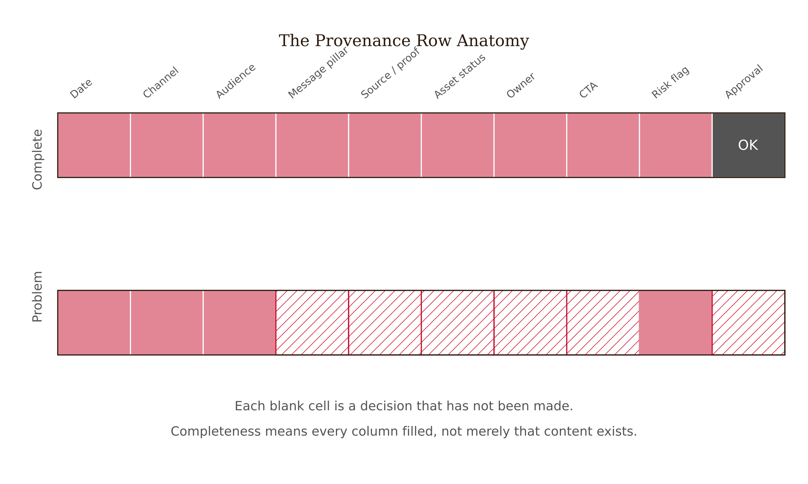

# Chapter 11 — Content Calendar With Provenance
*Thirty posts scheduled. Nobody could explain why any of them existed.*

The calendar is full. Two weeks of content, channel by channel, cheerful captions already written, assets linked, publish times set. The team spent an afternoon with an AI tool and produced what looks like a complete operational plan.

Then a claim in one of the posts gets challenged. A client asks which audience this series is targeting. Legal wants to know where the proof is for the product assertion in post fourteen. The social media manager, asked who approved the Tuesday Instagram post, says she thought someone else had reviewed it.

The calendar had thirty rows. None of them had a reason, a source, an owner, or an approval status. What looked like a coordination tool was actually a volume tracker — a record of content quantity with no information about content purpose. It could tell you what was scheduled to go out. It could not tell you why, for whom, on what basis, or who was accountable.

This is the failure that provenance fixes. Not a failure of the AI tool, which produced exactly what it was asked for. A failure of the schema: the calendar was designed to organize publication logistics, not to preserve the decisions behind each row. Madison turns the content calendar from a scheduling artifact into a decision record — a document that carries the strategy forward into operations so that a post can be explained, defended, and revised when the conditions that justified it change.

---

## Why a Row in a Calendar Is a Claim

A content post is not neutral. Every post makes a claim about the brand — about what it stands for, who it speaks to, what it knows about its audience, and what it is asking the audience to do. Some of those claims are explicit (a product benefit assertion, a discount offer, a statistic). Many are implicit (the tone signals the brand personality, the channel choice signals the audience, the CTA signals the conversion priority). Both kinds of claims carry professional accountability.

This means that the question "is this a good post?" has two parts. One is a craft question: is the copy clear, the image compelling, the format right for the channel? That is the question most content review processes ask. The other is an evidence question: is the claim this post makes something we can defend? Is it sourced? Is it targeted to an audience we have evidence to address? Is the timing right given what we know about the competitive environment and the current conversation?

| Craft Dimension (what most reviews assess) | Evidence Dimension (what provenance adds) |
| --- | --- |
| Copy quality | Claim accuracy and sourcing |
| Visual execution | Asset approval status |
| Format / channel fit | Audience match (evidence-based) |
| Call-to-action clarity | CTA alignment with campaign objective |
| Tone consistency | Brand voice authorization |

*Most content review processes stop at the left column. Provenance adds the right column — the evidence layer that makes a post defensible, not just polished.*


*Figure 11.1 — Two-part post evaluation*

The evidence question is harder, which is why it usually does not get asked. A content calendar that requires every row to have a source, a proof reference, and an audience designation is more work to build than one that requires only copy and a publish date. It is also far more valuable — because it converts the calendar from a task list into a record of decisions, which means that six weeks into the campaign when a post gets questioned, the team can answer.

---

## The Anatomy of a Provenance Row

A content calendar row with provenance has more columns than the typical scheduling template. Each column addresses a specific accountability question. None of them is optional.

**Date and channel.** The logistical foundation. Date is the publish schedule. Channel is the platform — not just the platform name but the specific account or placement, because a brand may have different voice standards across its Instagram and LinkedIn presences.

**Audience.** Which segment this post addresses. This should be specific enough to be testable: not "general audience" but "existing customers — loyalty tier" or "in-market buyers — 25-40 consideration segment." The audience field connects the post to the evidence base for that segment. If there is no audience evidence for the segment named, that is a risk flag, not a reason to leave the field blank.

**Message pillar.** Which strategic priority this post serves. The creative brief defines the message pillars; the calendar row cites which pillar it is executing. This column answers the question "why does this post exist at the campaign level?" A post with no message pillar connection should be removed or its connection should be argued explicitly.

**Source and proof.** The evidentiary foundation for any claim in the post. A product benefit assertion needs a source. A statistic needs a citation. A competitive claim needs documentation. If the post makes no explicit claim, the source field should note that — "no factual claim; brand voice expression only" is a valid entry. What is not valid is leaving the field empty because filling it requires work.

**Asset and approval status.** Which creative asset is used and whether it has been approved. Asset approval is often handled in a separate workflow; the calendar row should record the current status, not assume it. "Asset pending legal review" is a legitimate calendar row. "Asset TBD" in a row marked publish-ready is a workflow failure.

**Owner.** The named person accountable for this row. Not the team. Not the function. A person. The owner is responsible for verifying that the source is accurate, that the asset is approved, and that the post is ready to publish.

**CTA.** The call to action — what the post asks the audience to do. This should be specific (visit URL, download resource, register for event) and connected to the campaign objective. A CTA that does not connect to a campaign objective is a row that has drifted from strategy.

**Risk flag.** A field for any known risk that requires attention before publication: a claim that is under legal review, a timing sensitivity (this post should not go out the same week as a competitor's product launch), a cultural or contextual note. Risk flags do not block a row. They require that the owner has made an explicit decision to proceed despite the risk.

**Approval status.** Whether the row has been reviewed and cleared by whoever holds approval authority. Draft, reviewed, approved, or holds. No row moves to published without an approval status of "approved."

| Date | Channel | Audience | Message Pillar | Source / Proof | Asset | Owner | CTA | Risk Flag | Approval Status |
| --- | --- | --- | --- | --- | --- | --- | --- | --- | --- |
| March 12 | Instagram | Existing customers – loyalty tier | Product efficacy | Internal trial results doc v3.2 | Product hero shot (approved 3/8) | J. Morales | Visit product page – spring offer | None | Approved (A. Chen, 3/10) |
| March 14 | LinkedIn | General audience | TBD | None | Asset TBD | — | TBD | — | Draft |

*The second row should not exist in a calendar that is ready to execute. Each blank field is a decision that has not been made.*


*Figure 11.2 — The anatomy of a provenance row*

The calendar is complete when every row has every column filled and every "draft" status has an owner who knows what needs to happen before it moves to "approved." It is not complete when every row has a piece of content in it.

---

## Generating Rows Without Losing Strategy

AI assistance accelerates the row-generation step significantly. Given a brief, a set of message pillars, a channel list, and a time range, an agent can produce a full calendar draft in minutes. The draft will have plausible topics, reasonable channel assignments, and passable caption options.

What it will not have is provenance. The agent can fill in the logistical fields. It cannot supply the source (because it does not have access to the proof map), the specific audience designation (because it does not know the evidence base for each segment), or the approval status (because it is not part of the approval process). The risk flag requires human contextual judgment about timing and sensitivity that the agent does not have.

This creates a specific workflow discipline: use the agent to build the skeleton, then complete the provenance fields as a human act. The sequence matters. Running the agent first and then treating the output as a complete calendar is the failure mode — the fields left empty get filled with nothing, the approvals get assumed, and the calendar that looked like it was done is actually a draft with a scheduling interface laid on top of it.


*Figure 11.3 — Calendar build sequence*

<!-- → [DIAGRAM: Calendar build sequence — five stages: (1) Brief → Message Pillars → Audience Evidence (human) → (2) Agent generates candidate rows (AI) → (3) Human reviews rows for strategic alignment, removes unconnected rows (human) → (4) Human completes provenance fields: source, owner, risk, CTA (human) → (5) Approval workflow: owner confirms, approver signs off (human) — annotated: stages 1, 3, 4, 5 are human-required; stage 2 is AI-assisted. Caption: The agent accelerates stage 2. It does not substitute for stages 3–5, where the decisions that make the calendar defensible get made.] -->

A practical test for whether the provenance fields have been completed genuinely rather than nominally: can a teammate who was not involved in building the calendar pick up any row and explain it? They should be able to say: this post serves this audience segment based on this evidence, makes this claim supported by this source, was approved by this person on this date, and carries this risk status. If they cannot reconstruct that chain from the calendar row, the row is not complete.

---

## Risk Flags and the Judgment They Require

The risk field deserves specific attention because it is the column that most resists AI assistance and most directly encodes professional judgment.

A risk flag is not a quality rating. It is a record that someone noticed a condition that affects the post's readiness — and made an explicit decision about it. The condition could be a claim under legal review. It could be a cultural moment that makes certain messaging inadvisable this week. It could be a timing conflict with a competitor's announcement. It could be a source that is accurate but dated, and the owner is choosing to publish with a caveat rather than wait for a refresh.

In each case, the risk flag does two things. It records that the condition was seen. And it documents that the owner accepted responsibility for the decision to proceed. An unmarked row implies that no risks were identified. A flagged row with an approved status implies that risks were identified and a named person decided they were acceptable.

| Risk Type | Example Entry | Required Response |
| --- | --- | --- |
| Legal | "Claim 'clinically proven' under review — legal response expected by 3/15" | Hold approval until legal clears or rewrite claim without assertion |
| Timing | "Competitor product launch week of 3/18 — saturation risk" | Owner decides whether to move post or proceed with awareness of context |
| Source recency | "Stat sourced from 2022 industry report — no newer data available" | Owner notes in approval record that recency was considered |
| Cultural | "Holiday timing — verify no conflict with community calendar for target audience" | Owner verifies and documents clearance |
| Audience | "Segment evidence is directional only — no strong survey data for this demographic" | Owner notes evidentiary weakness; mark as 'can suggest' per evidence standard |

*Risk flags are not reasons to cancel a post. They are records that the conditions were seen and a person made a decision.*


*Figure 11.4 — Risk flag types and responses*

The risk flag column is also where the warranted-verb discipline from Chapter 5 connects to the content calendar. A post that makes a claim the evidence cannot support should either have the claim rewritten to match the evidence, or carry a risk flag noting the evidentiary limitation and a named approver who accepted that limitation. What it should not do is carry an unqualified claim without any record that its basis was examined.

---

## When Evidence Changes

A content calendar with provenance has one advantage that a standard scheduling calendar cannot offer: it is revisable in a principled way.

Campaigns run in a changing environment. A competitor launches. A study comes out. The cultural conversation shifts. An asset fails legal review. A source turns out to be outdated. In a standard calendar, these events require ad hoc intervention — someone notices a problem, pulls the post, and the team scrambles. The intervention is reactive and undocumented.

In a provenance calendar, each row carries the conditions that justified it. When a condition changes, the row's validity can be reassessed against those conditions. The source is no longer accurate — which rows depend on that source? Flag them for review. The audience evidence shifted — which rows addressed that segment? Surface them for an owner decision. The message pillar was de-prioritized — which rows were built around it? Remove them with a record of why.

This is not just organizational hygiene. It is how the calendar remains connected to the strategy as the campaign runs, rather than drifting into pure execution on a schedule that was right three weeks ago.

---

## What Would Change My Mind

The strongest objection to provenance calendars is operational: the schema is too heavy for the pace of content work. A brand team publishing daily across six channels cannot maintain ten-column rows for every post. The overhead of provenance will be displaced by production pressure, the fields will be filled nominally rather than genuinely, and the result will be a false sense of accountability rather than real accountability.

I think this is partially right and partially a scope error. Not every post warrants full provenance treatment. A purely brand-voice expression post with no factual claim, no specific audience targeting, and low strategic weight can reasonably run with lighter documentation. The full provenance schema is warranted for posts that carry claims, posts that address specific audience segments with evidence-based messaging, and posts that represent the campaign's most important strategic work. The calendar discipline is: know which rows require full provenance and apply it there, rather than applying a watered-down version everywhere.

## Still Puzzling

The approval field creates a clear accountability record when it is used well. What it cannot easily represent is the quality of the approval. A row marked "approved" might have received thirty seconds of inattentive review or a thorough examination of source, claim, audience fit, and risk. Both look identical in the calendar. I have not found a practical way to encode review quality in a calendar row — other than requiring reviewers to leave a brief note rather than just a name and date — that does not add so much friction it stops being used.

---

## LLM Exercises

**Exercise 1 — Provenance Audit**
Take a content calendar you have recently worked with — or a hypothetical two-week calendar you describe to the LLM. Ask the LLM to identify which columns are missing that would make the calendar a provenance document rather than a scheduling tool. Then: for three rows, ask the LLM to generate the provenance fields it can — audience, message pillar, CTA — and flag which fields require human input it cannot supply.

**Exercise 2 — Risk Flag Generation**
Give the LLM three post descriptions from a campaign calendar — include the claim, the channel, and the timing context. Ask it to generate a risk flag for each one: what condition, if present, would require human review before this post publishes? Then assess: did the LLM surface the right risks? What did it miss that you would flag from professional experience?

**Exercise 3 — Row Removal**
Give the LLM a five-row calendar section and ask it to identify which rows lack a clear connection to a message pillar or audience designation. For each flagged row, ask the LLM to propose either a revision that reconnects it to strategy or an argument for why it should be removed. Then make the final call yourself — the LLM can surface the candidates; the decision is yours.

---

## Exercises

**Warm-up**

1. *(Basic recall)* Name five columns in a provenance content calendar and explain what accountability question each one answers. *What this tests: whether you can connect the schema structure to the professional decisions it encodes.*

2. *(Concept check)* What is the difference between a content calendar that is "complete" in the logistical sense and one that is "complete" in the provenance sense? Give a specific example of a row that is logistically complete but provenance-incomplete. *What this tests: whether you understand what provenance adds beyond scheduling.*

3. *(Definition)* What does a risk flag record, and why does a flagged row with an "approved" status represent a stronger accountability record than an unflagged row with an "approved" status? *What this tests: whether you understand that visibility of risk is more defensible than absence of risk.*

**Application**

4. *(Moderate)* You are building a two-week calendar for a product launch campaign. The campaign has three message pillars: product efficacy, value versus competitors, and sustainability credentials. Write three calendar rows — one for each pillar — with full provenance columns: date, channel, audience, message pillar, source/proof, asset status, owner, CTA, risk flag, approval status. Use "pending" or "TBD" only where you explicitly note why the field cannot yet be completed. *What this tests: whether you can build a provenance row end-to-end, including the fields that require decisions you must make explicit.*

5. *(Moderate)* An AI tool generates a 14-row content calendar for a wellness brand. Twelve of the rows have copy and channel assignments. None have sources, risk flags, or approval statuses. Two rows contain product benefit claims. Describe the workflow steps required to bring this calendar to publish-ready status. Who is responsible for each step? Which steps cannot be completed by the AI tool? *What this tests: whether you can identify the human-required stages in a provenance workflow.*

6. *(Moderate)* A scheduled post claims that a product is "used by over 10,000 professionals." The source document for this claim is an internal survey from 18 months ago with a sample of 400 self-selected respondents. Apply the warranted-verb analysis from Chapter 5 to this claim. Should it be published as written, rewritten, or flagged? Write the risk flag entry and, if appropriate, a rewritten version of the claim. *What this tests: whether you can connect the evidence verification framework to a live calendar decision.*

**Synthesis**

7. *(Challenging)* Midway through a campaign, a new study is published that contradicts a product efficacy claim in four currently scheduled posts. Describe the cascade: which provenance fields tell you which rows are affected? What decision process follows? Who is accountable at each stage? What gets logged? *What this tests: whether you understand how provenance enables principled revision when conditions change, not just initial accountability.*

8. *(Challenging)* A colleague argues that the provenance schema is too heavy for a team publishing daily content and that it will be abandoned under production pressure within two weeks. Design a lighter-weight provenance approach — perhaps a reduced column set for routine posts and a full schema for high-stakes posts — that preserves the core accountability functions without the full overhead. Define what triggers the full schema. Define what the minimum schema must always include. *What this tests: whether you can apply the principle proportionally rather than mechanically.*

**Challenge**

9. *(Open-ended)* "Still Puzzling" notes that approval status cannot distinguish between nominal review and genuine review — both produce the same calendar entry. Design a review protocol for a content team that would make review quality more visible without creating friction that causes the protocol to be abandoned. What would reviewers be required to record? What would trigger escalation to a more thorough review? How would you audit whether the protocol was being followed genuinely or nominally? *What this tests: whether you can reason about the limits of accountability systems and design improvements that engage with those limits honestly.*

---

## Chapter 11 Exercises: Content Calendar With Provenance
**Project:** Your Own Brand Intelligence System
**This chapter adds:** a content calendar where each row carries provenance — audience, message pillar, source for every claim, owner, risk flag, and approval status — so any post can be explained, defended, and revised when the conditions that justified it change.

---

### Exercise 1 — When to Use AI
**The judgment:** Three places where AI accelerates calendar work without compromising it:
- Generating the calendar skeleton from a brief, message pillars, channel list, and date range — *Why AI works here:* producing plausible topics and channel assignments at volume is exactly the logistical drafting models are fast at, and the output is a starting scaffold you will review row by row. (Bulk generation of a checkable draft.)
- Drafting candidate risk flags for a set of post descriptions — "what condition, if present, would require human review before this publishes?" — *Why AI works here:* surfacing the standard categories (legal, timing, source recency, cultural, audience) is a recall task you can audit against your own professional knowledge of what it missed. (Checklist generation under review.)
- Screening a draft calendar for rows with no message-pillar or audience connection — *Why AI works here:* flagging rows that fail a structural rule is mechanical, and you make the keep/cut decision yourself. (Rule-based triage; you decide.)

**The tell:** You know you are using AI appropriately when you can evaluate the output — when you have independent criteria to judge whether it is correct, complete, and fit for purpose.

---

### Exercise 2 — When NOT to Use AI
**The judgment:** Three places where letting AI fill the provenance fields breaks the calendar:
- Supplying the source/proof for a claim in a post — *Why AI fails here:* the model has no access to your proof map and will confidently invent an internal-doc reference or a statistic; this is missing ground truth plus hallucination, and a fabricated source is worse than a blank one.
- Setting the risk flag's final decision — whether to ship a post the same week as a competitor's launch, or with a source that is accurate but dated — *Why AI fails here:* this is contextual professional judgment about timing, sensitivity, and acceptable exposure that the model cannot weigh, and accepting the risk is an accountability act.
- Marking a row "approved" — *Why AI fails here:* approval is a named human accepting responsibility for the row going public; a model cannot be the owner, and an AI-assigned "approved" is the exact false-accountability the chapter warns against.

**The tell:** You know you have crossed the line when you are using AI output as your reason for a conclusion rather than as a tool for reaching one.
**Series connection:** Tier 6 (Accountability). The provenance schema exists so that every row names a human owner and a human approver; the model can build the skeleton (stage 2) but the decisions that make the calendar defensible — source, risk, approval — are precisely the human-required stages Tier 6 guards.

---

### Exercise 3 — LLM Exercise
**What you're building this chapter:** a provenance-complete calendar section — the AI builds the skeleton, you and the prompt keep the provenance fields honest. · **Tool:** Claude (claude.ai chat) — a single calendar section is a one-pass artifact; the chat keeps the skeleton and the flagged fields visible together.

**The Prompt:**
```
You are helping me build a content calendar with PROVENANCE — not just a scheduling
list. There are two kinds of fields and you must respect the line between them.

YOU MAY FILL (logistical / strategic skeleton):
  Date, Channel, Audience (a specific testable segment, e.g. "existing customers —
  loyalty tier", never "general audience"), Message pillar (from the list I give
  you), CTA (specific and tied to a campaign objective), and a DRAFT caption.

YOU MAY NOT FILL — instead mark each as [HUMAN: ...] describing what the human must do:
  Source / proof (you have no access to my proof map — never invent a source, doc,
    statistic, or citation), Asset approval status, Risk flag (requires human timing/
    sensitivity judgment), Approval status (a named human must own this).

Produce a 5-row calendar as a table with all ten columns: Date | Channel | Audience |
Message pillar | Source/Proof | Asset | Owner | CTA | Risk flag | Approval status.

For any row that makes a factual or product claim, put the claim text in the
Source/Proof cell as "[HUMAN: claim '...' needs a source from the proof map]". For
rows with no factual claim, you may write "no factual claim; brand-voice only."

Then, below the table, list which fields you left for the human and why each one
required human input you could not supply.

MY INPUTS:
Message pillars: [FILL IN: your 2–4 pillars]
Channels: [FILL IN]
Date range: [FILL IN]
Audience segments I have evidence for: [FILL IN: from your persona evidence sheet]
```
**What this produces:** a ten-column calendar with the skeleton filled and every provenance field that needs ground truth explicitly handed back to you as a `[HUMAN: ...]` work item. **How to adapt this prompt:** *For your own brand:* the [FILL IN] audience segments should come straight from your Chapter 10 persona evidence sheet, so each row's audience field points to real evidence; the prompt is built so the model cannot quietly invent a source. *For ChatGPT / Gemini:* keep the explicit "YOU MAY FILL / YOU MAY NOT FILL" split; re-state the no-invented-source rule below the table because the model may try to be "helpful" and guess a citation. *For a Claude Project:* load your proof map and persona sheet as project knowledge — then the model can legitimately propose source matches for review instead of marking them all `[HUMAN]`, but approval and risk still stay human. **Connection to previous chapters:** this is where the claims-and-proof map (Ch 9) and the persona evidence sheet (Ch 10) get put to work — the source field cites the proof map, the audience field cites the persona sheet. **Preview of next chapter:** Chapter 12 audits the touchpoints this calendar schedules, checking each for brand-voice consistency and citing the rule behind every finding.

---

### Exercise 4 — CLI Exercise
**What you're building this chapter:** a provenance-audit pass over an existing calendar file that flags every unfilled or unsupported provenance field. **Tool:** Claude Code · **Skill level:** Intermediate

**Setup:**
- [ ] Claude Code installed and opened in a folder containing a draft calendar (`./calendar/calendar.md` or `.csv`).
- [ ] Your `./proof-inventory.md` and `./persona/persona-evidence-sheet.md` in the folder, if you have them.
- [ ] An `./audit/` output folder you are comfortable writing into.

**The Task:**
```
Audit ./calendar/ for provenance completeness. Do not turn it into a scheduling
checklist — check whether each row could be defended by a teammate who did not build
it.

READ: the calendar file(s) in ./calendar/ , plus ./proof-inventory.md and
./persona/persona-evidence-sheet.md if present.
DO NOT MODIFY the calendar or any source file. All inputs are read-only.
WRITE: one new file ./audit/provenance-audit.md and nothing else.

For each calendar row, report:
- Which of the ten provenance fields are blank or "TBD" (Date, Channel, Audience,
  Message pillar, Source/Proof, Asset, Owner, CTA, Risk flag, Approval status).
- For the Source/Proof field: if the row makes a claim, does a matching source exist
  in ./proof-inventory.md? If yes, cite the line. If no, mark "UNSUPPORTED CLAIM —
  needs source or rewrite." Never invent a source.
- For the Audience field: does the named segment appear in the persona evidence
  sheet? If not, flag "audience has no evidence base."
- A readiness verdict per row: publish-ready / provenance-incomplete / unsupported-
  claim.

Do NOT fill in any field yourself, do NOT mark anything approved, and do NOT guess an
owner. You are auditing, not completing.

STOP when ./audit/provenance-audit.md is written. Ask before running anything else.

VERIFY before finishing: report the count of rows in each readiness verdict and list
every row carrying an unsupported claim.
```
**Expected output:** one audit file listing, per row, the missing fields, unsupported claims, audience-evidence gaps, and a readiness verdict. **What to inspect in the output:** confirm every "supported" source cell cites a real proof-inventory line, and that no row was marked publish-ready while still carrying a `[HUMAN]`/TBD field. **If it goes wrong:** if the model starts *filling* fields instead of flagging them, it has slipped from auditor to author — re-run with "You are auditing, not completing" emphasized; and if it cites sources not in your inventory, those are hallucinations, treat them as unsupported. **CLAUDE.md / AGENTS.md note:** add — "Calendar files are read-only during audits. The model never fills Source, Owner, Risk, or Approval. Claims without a proof-inventory match are flagged unsupported, never given an invented source." — so audits stay non-destructive and fabrication-free.

---

### Exercise 5 — AI Validation Exercise
**What you're validating:** the provenance calendar from Exercise 3 or the audit from Exercise 4. **Validation type:** provenance-completeness and source-fabrication check. **Risk level:** High — these rows schedule public claims; a fabricated source or a falsely "approved" row ships exposure. **Setup:** put the calendar beside the proof inventory and persona sheet.

**The Validation Task:** "Evaluate the AI output using this checklist. For each item record Pass / Fail / Cannot determine and explain."
```
Validation Checklist — Content Calendar With Provenance
□ Correctness: Is each Audience a specific testable segment, and does each CTA connect
  to a stated campaign objective?
□ Completeness: Does every row have every one of the ten columns filled or explicitly
  marked as a human work item — no silent blanks?
□ Source integrity: For every row with a claim, is the Source either a real proof-
  inventory line or an honest "needs source"? Any cited source you cannot find is a
  fabrication.
□ Audience evidence: Does each named segment trace to the persona evidence sheet, or
  is it flagged as evidence-less?
□ Accountability: Did the model leave Owner, Risk flag, and Approval to a human rather
  than assigning them itself?
□ Failure mode check: fluent-but-wrong (a tidy calendar that looks done but is a
  scheduling skin over unmade decisions)? invented source citation? a row marked
  "approved" with no human behind it? missing ground truth?
```
**What to do with your findings:** any fabricated source or AI-assigned approval is a stop-ship item — the row goes back to its owner. Provenance-incomplete rows become work items, not publishable content. **AI Use Disclosure prompt:** "AI generated the calendar skeleton and flagged provenance gaps; a human supplied every source from the proof map, made all risk and approval decisions, and named every owner. No source citation in this calendar originates from the model." **Series connection:** the central failure mode is the scheduling-skin illusion — a calendar that looks complete but hides unmade decisions and possibly invented sources — and the tier is Tier 6 (Accountability), which is why owner and approval must remain human.

---
**Tags:** content-provenance, calendar-accountability, source-citation, risk-flagging, audience-traceability, publish-readiness
